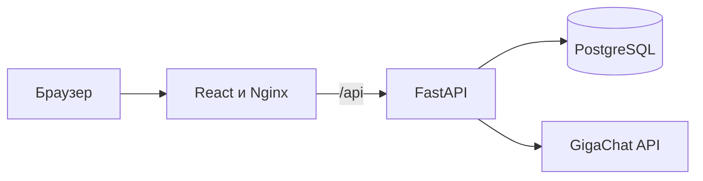

# Muller's Firearms

Демонстрационный full-stack интернет-магазин товаров охотничьего и оружейного
назначения с ИИ-консультантом. Проект создан как выпускная квалификационная
работа по направлению 09.03.02 и развивается как портфолио-проект.

> Проект не является реальным каналом дистанционной продажи оружия или
> боеприпасов. Каталог, цены, остатки и заказы используются только для
> демонстрации программной реализации.

## Возможности

- регистрация и JWT-аутентификация;
- вход в отдельный временный демо-аккаунт без регистрации;
- роли пользователя и администратора;
- категории, каталог, поиск и фильтрация товаров;
- корзина и оформление демонстрационного заказа;
- история и статусы заказов;
- создание и редактирование товаров в админ-панели, загрузка фотографий;
- ИИ-консультант на базе GigaChat с контекстом каталога;
- очистка собственной истории диалога;
- Swagger/OpenAPI для серверной части;
- воспроизводимый запуск через Docker Compose.

## Технологии

| Часть | Стек |
|---|---|
| Frontend | React, React Router, Axios, Vite |
| Backend | FastAPI, Pydantic, SQLAlchemy Async |
| Данные | PostgreSQL, Alembic |
| ИИ | GigaChat API |
| Инфраструктура | Docker Compose, Nginx, GitHub Actions |

## Архитектура



Frontend и API доступны через единый origin. В режиме разработки Vite
проксирует `/api` на FastAPI, а в контейнерной сборке это делает Nginx.

## Быстрый запуск

Требования: Docker с поддержкой Compose.

```bash
cp .env.example .env
docker compose up --build
```

После запуска:

- приложение: <http://localhost:3000>;
- API: <http://localhost:8000>;
- Swagger: <http://localhost:8000/docs>;
- PostgreSQL: `localhost:5432`.

При `SEED_DEMO_DATA=true` миграции применяются автоматически и создаются
демонстрационные категории, товары и администратор. Учетные данные задаются
через `DEMO_ADMIN_EMAIL` и `DEMO_ADMIN_PASSWORD` в `.env`.

Интеграция с GigaChat необязательна для запуска остальных модулей. Чтобы
включить консультанта, выполните настройки из раздела ниже.

## Знакомство с проектом без регистрации

На главной странице и в форме входа есть кнопка **Войти в демо-аккаунт**.
Посетитель получает отдельный профиль с вымышленными данными, одну позицию
в корзине и два примера заказов со статусами «Подтверждён» и «Завершён».
Можно оформить ещё один учебный заказ, менять корзину и пользоваться чатом.
Для ответа AI необходима обычная серверная настройка GigaChat.

При открытии демо с главной показывается профиль с быстрыми переходами.
Если посетитель пришёл со страницы, требующей входа, он возвращается туда.
Каждый вход создаёт новую сессию; обновление страницы сохраняет текущую.
Корзины, заказы и переписки разных сессий не пересекаются. Начальные примеры
и учебное оформление не меняют общий каталог и его остатки.

Параметры в корневом `.env` (Compose использует эти же значения по умолчанию):

```dotenv
DEMO_LOGIN_ENABLED=true
DEMO_SESSION_MINUTES=60
DEMO_MAX_SESSIONS=100
```

Вне Compose демо-вход выключен по умолчанию. `DEMO_LOGIN_ENABLED=false`
отключает кнопку и серверный вход, а также доступ по уже выданным демо-токенам.
Настройка независима от `SEED_DEMO_DATA`: демо-вход использует существующие
активные товары в наличии и не пересоздаёт каталог. Если таких товаров нет,
возвращается понятная ошибка без создания пустого аккаунта.

Срок демо-токена совпадает со сроком сессии. Демо-аккаунты не имеют пароля
для обычного входа или административных прав и не включаются в списки
зарегистрированных пользователей и заказов администратора. Обычные аккаунты
и их данные продолжают работать как прежде.

При следующем демо-входе сервер удаляет истёкшие демо-аккаунты вместе с их
корзинами, заказами и сообщениями. После истечения даётся 5 минут на завершение
уже запущенных запросов перед удалением. Периодического фонового удаления нет:
без новых демо-входов истёкшие записи остаются в БД, но вход по ним уже закрыт.
Лимит в 100 записей учитывает этот запас времени; при его достижении новый
вход получает HTTP 429. В PostgreSQL создание и очистка сериализованы
транзакционной advisory-блокировкой, в том числе при нескольких API workers.
Этот лимит ограничивает размер демо-данных; ограничение частоты запросов и
расходов GigaChat следует настроить отдельно перед публичным развёртыванием.

## Подключение GigaChat

1. В проекте GigaChat API в личном кабинете Studio откройте **Настройки API →
   Получить ключ** и скопируйте **Authorization Key** целиком. В этом проекте
   используется готовая строка Base64, без префикса `Basic`. Client Secret
   отдельно и временный Access Token в эту настройку не подходят.
   [Инструкция GigaChat](https://developers.sber.ru/docs/ru/gigachat/quickstart/ind-using-api)
2. Откройте корневой файл `C:\Diplom\.env` рядом с `docker-compose.yml` и
   измените соответствующие строки, сохранив остальные настройки:

   ```dotenv
   GIGACHAT_AUTH_KEY=ваш_Authorization_Key
   GIGACHAT_SCOPE=GIGACHAT_API_PERS
   GIGACHAT_MODEL=GigaChat-2
   GIGACHAT_VERIFY_SSL=true
   GIGACHAT_CA_BUNDLE=/app/certs/russian_trusted_root_ca_pem.crt
   ```

   `GIGACHAT_API_PERS` соответствует личному API. Для корпоративного проекта
   используйте Scope из его настроек. Ключ хранится только на backend; файл
   `.env` исключён из Git. Во frontend и переменные `VITE_*` ключ не добавляйте.
3. Скачайте официальный корневой сертификат, который нужен для TLS-соединения
   с GigaChat, в `weapon-store-backend/certs`. В PowerShell:

   ```powershell
   cd C:\Diplom
   Invoke-WebRequest -Uri "https://gu-st.ru/content/lending/russian_trusted_root_ca_pem.crt" -OutFile ".\weapon-store-backend\certs\russian_trusted_root_ca_pem.crt"
   docker compose up -d --build backend frontend
   ```

   Файл попадёт в образ backend при сборке. Он добавляется к стандартным
   доверенным сертификатам только для запросов GigaChat; проверка TLS остаётся
   включённой. При запуске без Docker в `GIGACHAT_CA_BUNDLE` нужен локальный
   путь к сертификату. [Документация по сертификатам](https://developers.sber.ru/docs/ru/gigachat/certificates)
4. Войдите на сайт, откройте AI-чат и спросите, какие товары есть в каталоге.
   Backend сам получает Access Token и передаёт модели актуальные товары,
   характеристики и последние сообщения. Очистка чата удаляет личную историю
   из БД и сбрасывает контекст следующего разговора.

Если консультант недоступен, проверьте `docker compose logs --tail=80 backend`.
Ошибки 401/403 обычно требуют проверки ключа и Scope, 429 — лимитов проекта;
`CERTIFICATE_VERIFY_FAILED` — файла сертификата и пути внутри контейнера.
После изменения `.env` контейнер нужно пересоздать через `docker compose up -d backend`,
обычный `docker compose restart` не применяет новые переменные окружения.

## Управление товарами

Войдите администратором и откройте **Админ → Товары → Новый товар**. В форме
задаются категория, артикул, бренд, цены, остаток, описания и произвольные
характеристики. Рядом отображается предпросмотр. Существующий товар открывается
кнопкой **Редактировать**; его ID и сведения в уже оформленных заказах сохраняются.

Фотографию можно загрузить с компьютера (PNG/JPEG/WebP, до 8 МБ и 20 Мп) или
указать ссылкой. Загруженные файлы хранятся в отдельном Docker volume
`product_uploads` и сохраняются при обычной пересборке контейнеров. Для локального
запуска используется `weapon-store-backend/uploads/products`.

Флажок **Показывать в каталоге** управляет видимостью карточки в списках товаров.
Для упаковок добавьте характеристику **Количество в упаковке**, например **10 шт**,
и указывайте цену и остаток в упаковках. Создание, редактирование и загрузка
фотографий защищены серверной проверкой роли администратора.

## Остановка

Остановка приложения:

```bash
docker compose down
```

Удаление демонстрационной базы данных и загруженных фотографий:

```bash
docker compose down -v
```

## Локальная разработка

### Backend

```bash
cd weapon-store-backend
python -m venv .venv
source .venv/bin/activate
pip install -r requirements-dev.txt
alembic upgrade head
python -m app.seed
uvicorn app.main:app --reload
```

На Windows активация окружения выполняется командой
`.venv\Scripts\activate`.

### Frontend

```bash
cd weapon-store-frontend
npm ci
npm run dev
```

Локальный frontend откроется на <http://localhost:5173> и будет направлять
запросы `/api` на <http://localhost:8000>.

## Проверки

```bash
cd weapon-store-backend
ruff check app tests alembic
python -m pytest
alembic upgrade head --sql

cd ../weapon-store-frontend
npm run lint
npm run build
```

Эти же проверки выполняются в GitHub Actions при push и pull request.

## Структура

```text
.
├── docker-compose.yml
├── weapon-store-backend/
│   ├── alembic/
│   ├── app/
│   └── tests/
└── weapon-store-frontend/
    ├── public/
    └── src/
```

## Статус развития

Реализованы единый запуск, миграции, демонстрационный каталог, страницы товаров,
личный кабинет, админ-панель с редактором товаров и ИИ-консультант с контекстом
каталога. Интерфейс выполнен в общей тёмной glass-стилистике; основные серверные
сценарии покрыты тестами.
