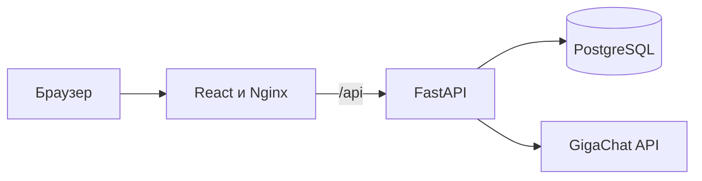

# Muller's Firearms

Демонстрационный full-stack интернет-магазин товаров охотничьего и оружейного
назначения с ИИ-консультантом. Проект создан как выпускная квалификационная
работа по направлению 09.03.02 и развивается как портфолио-проект.

> Проект не является реальным каналом дистанционной продажи оружия или
> боеприпасов. Каталог, цены, остатки и заказы используются только для
> демонстрации программной реализации.

## Возможности

- регистрация и JWT-аутентификация;
- роли пользователя и администратора;
- категории, каталог, поиск и фильтрация товаров;
- корзина и оформление демонстрационного заказа;
- история и статусы заказов;
- ИИ-консультант на базе GigaChat с контекстом каталога;
- Swagger/OpenAPI для серверной части;
- воспроизводимый запуск через Docker Compose.

## Технологии

| Часть | Стек |
|---|---|
| Frontend | React, React Router, Axios, Vite |
| Backend | FastAPI, Pydantic, SQLAlchemy Async |
| Данные | PostgreSQL, Alembic |
| ИИ | GigaChat API |
| Инфраструктура | Docker Compose, Nginx, GitHub Actions |

## Архитектура



Frontend и API доступны через единый origin. В режиме разработки Vite
проксирует `/api` на FastAPI, а в контейнерной сборке это делает Nginx.

## Быстрый запуск

Требования: Docker с поддержкой Compose.

```bash
cp .env.example .env
docker compose up --build
```

После запуска:

- приложение: <http://localhost:3000>;
- API: <http://localhost:8000>;
- Swagger: <http://localhost:8000/docs>;
- PostgreSQL: `localhost:5432`.

При `SEED_DEMO_DATA=true` миграции применяются автоматически и создаются
демонстрационные категории, товары и администратор. Учетные данные задаются
через `DEMO_ADMIN_EMAIL` и `DEMO_ADMIN_PASSWORD` в `.env`.

Интеграция с GigaChat необязательна для запуска остальных модулей. Чтобы
включить консультанта, заполните `GIGACHAT_AUTH_KEY`.

Остановка приложения:

```bash
docker compose down
```

Удаление только демонстрационной базы данных:

```bash
docker compose down -v
```

## Локальная разработка

### Backend

```bash
cd weapon-store-backend
python -m venv .venv
source .venv/bin/activate
pip install -r requirements-dev.txt
alembic upgrade head
python -m app.seed
uvicorn app.main:app --reload
```

На Windows активация окружения выполняется командой
`.venv\Scripts\activate`.

### Frontend

```bash
cd weapon-store-frontend
npm ci
npm run dev
```

Локальный frontend откроется на <http://localhost:5173> и будет направлять
запросы `/api` на <http://localhost:8000>.

## Проверки

```bash
cd weapon-store-backend
ruff check app tests alembic
pytest
alembic upgrade head --sql

cd ../weapon-store-frontend
npm run lint
npm run build
```

Эти же проверки выполняются в GitHub Actions при push и pull request.

## Структура

```text
.
├── docker-compose.yml
├── weapon-store-backend/
│   ├── alembic/
│   ├── app/
│   └── tests/
└── weapon-store-frontend/
    ├── public/
    └── src/
```

## Статус развития

Текущий этап закладывает инфраструктуру портфолио-версии: единый запуск,
миграции, расширенную модель данных, демонстрационное наполнение, тестовый
контур и CI. Следующие этапы включают полноценный CRUD, новый интерфейс
Muller's Firearms, личный кабинет и улучшенную логику ИИ-консультанта.
